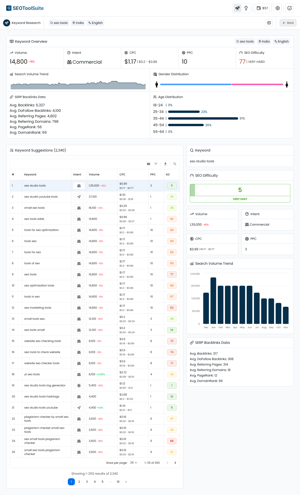

# SEOToolSuite

SEOToolSuite provides free and open source SEO tools for everyone. Keyword research and more, powered by DataForSEO.

## SEO Tools

### Keyword Research



Find thousands of keyword suggestions with multiple metrics like search volume, trend, search intent, seo difficulty, and more. Uses DataForSEO APIs.

## Prerequisites

- DataForSEO API
- Node.js (for localhost/server deployment)

## Getting Started

You can use the cloud version of SEOToolSuite for free or run it on your localhost/server as well.

### Using the cloud version

Simply head to [https://seotoolsuite.nitishkgupta.com](https://seotoolsuite.nitishkgupta.com), add required API credentials (DataForSEO), and use the tools right-away!

### Running on localhost/server

#### 1. Clone the repo.

```bash
git clone https://github.com/nitishkgupta/seotoolsuite.git
```

#### 2. Install dependencies.

```bash
npm install
```

#### 3. Build the app.

```bash
npm run build
```

#### 4. Start the app.

```bash
npm run start
```

## Getting Updates

The cloud version is updated automatically. For the local version, follow the below steps:

### 1. Pull the latest changes from the repo.

```bash
git pull
```

### 2. Rebuild the app.

```bash
npm run build
```

### 3. Start the app.

```bash
npm run start
```

## Changelog

The changelog is available [here](CHANGELOG.md).
