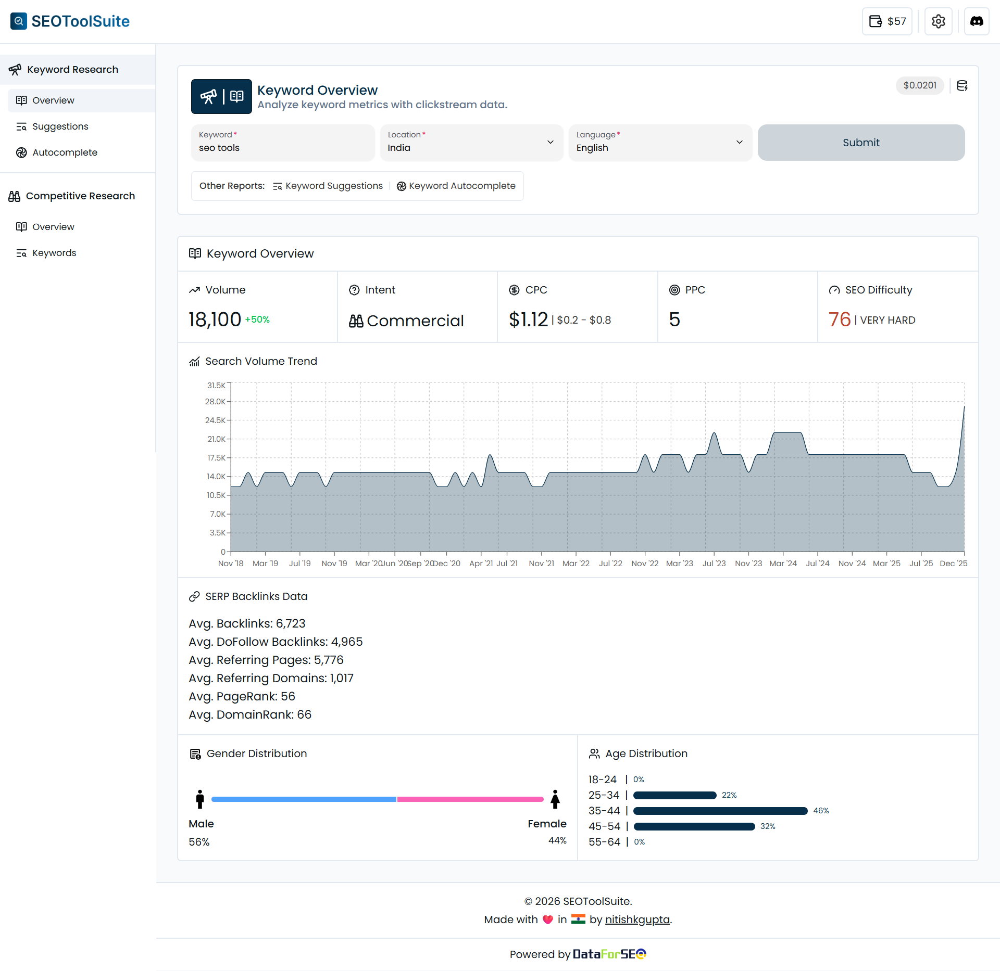
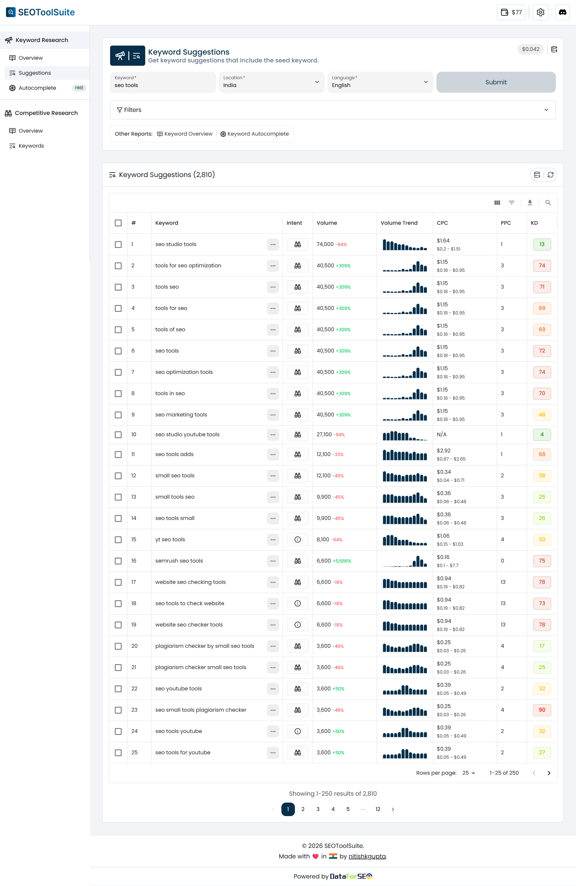
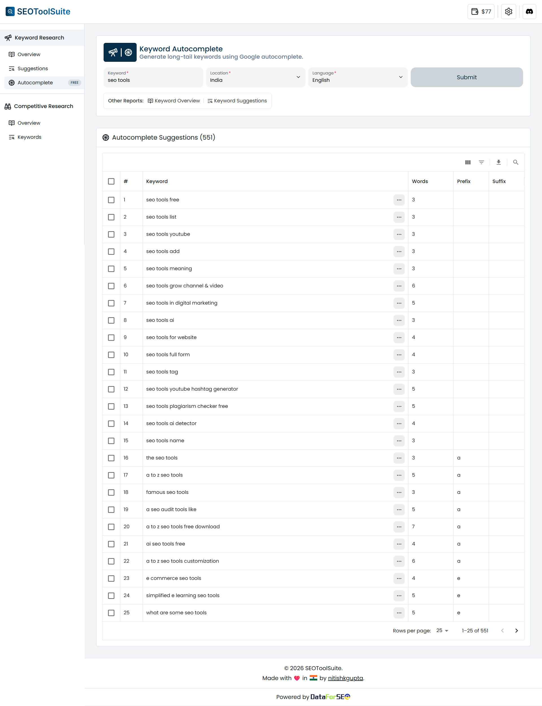
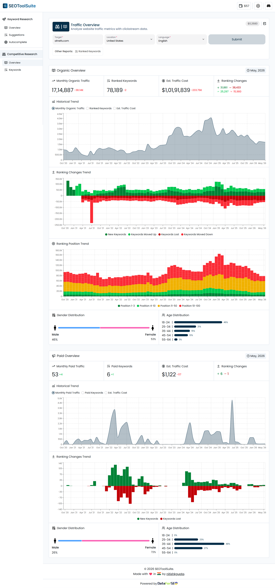

SEOToolSuite provides **free and open source SEO tools for everyone**. Keyword research, competitive research, and more, powered by DataForSEO.

[**Get Started**](https://seotoolsuite.nitishkgupta.com/tools) - [**Changelog**](CHANGELOG.md) - [**DataForSEO Account (Free 1$ Credits)**](https://dataforseo.com/?aff=44560) - [**Discord Server**](https://discord.gg/Wt4RN4Xy8n)

[](https://github.com/nitishkgupta/seotoolsuite/releases) [](LICENSE) [
](https://seotoolsuite.nitishkgupta.com)

## 🔍 SEO Tools

### Keyword Research

#### Keyword Overview



The Keyword Overview tool gives a quick snapshot of a keyword’s performance, including search volume, intent, CPC, competition, trends, and audience insights - helping you evaluate keyword potential and plan your SEO strategy faster.

#### Keyword Suggestions



The Keyword Suggestions tool generates a large list of relevant keyword ideas based on your seed keyword. It provides key metrics like search volume, intent, CPC, competition, and difficulty, helping you discover new keyword opportunities and expand your SEO strategy.

#### Keyword Autocomplete



The Keyword Autocomplete tool generates long-tail keyword ideas using Google autocomplete data. It helps you discover real search queries, identify content opportunities, and expand your keyword research quickly.

### Competitive Research

#### Traffic Overview



The Traffic Overview tool analyzes a website’s organic and paid search performance. It provides insights such as estimated traffic, ranked keywords, traffic cost, ranking changes, and historical trends - helping you understand competitor performance and identify SEO opportunities.

## 📋 Prerequisites

- [DataForSEO API](https://dataforseo.com/?aff=44560) (for tools using DataForSEO APIs)
- [Upstash Redis](https://upstash.com) (for data caching)
- Node.js (for localhost/server deployment)

## 🚀 Getting Started

You can use the cloud version of SEOToolSuite for free or run it on your localhost/server as well.

### Using The Cloud Version

Simply head to [https://seotoolsuite.nitishkgupta.com](https://seotoolsuite.nitishkgupta.com), and use the tools right-away!

### Running On Localhost/Server

#### 1. Clone the repo.

```bash
git clone https://github.com/nitishkgupta/seotoolsuite.git
```

#### 2. Install dependencies.

```bash
npm install
```

#### 3. Build the app.

```bash
npm run build
```

#### 4. Start the app.

```bash
npm run start
```

## 🔄 Getting Updates

The cloud version is updated automatically. For the local version, follow the below steps:

### 1. Pull the latest changes from the repo.

```bash
git pull
```

### 2. Install dependencies.

```bash
npm install
```

### 3. Rebuild the app.

```bash
npm run build
```

### 4. Start the app.

```bash
npm run start
```

## 🛠️ Tech Stack

- Next.js

## ℹ️ Frequently Asked Questions

### 1. Are my API credentials secured?

Yes, your API credentials are stored locally in your browser (via LocalStorage) and are never sent to any server.

### 2. Are these SEO tools free to use?

Yes, you only pay for your API usage (DataForSEO). There are no extra or hidden charges.

### 3. Can I reuse the code?

Yes, the entire codebase is licensed under the MIT License, so you’re free to use, modify, and reuse the code as you wish.

### 4. Where do I report bugs or request features?

If you’ve found a bug or have a feature suggestion, feel free to open an [issue](https://github.com/nitishkgupta/seotoolsuite/issues) or use the Discord Server. Your feedback is always welcome!

## 📝 Changelog

The changelog is available [here](CHANGELOG.md).
